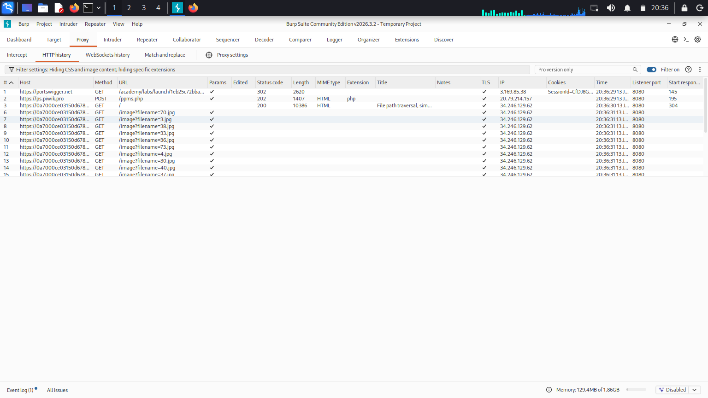
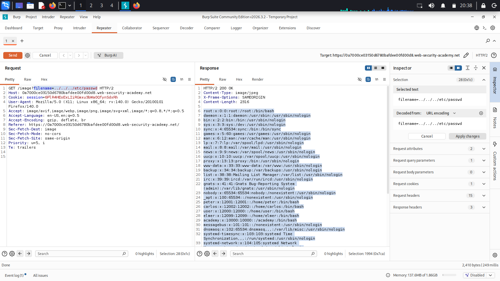

# Lab: File path traversal, simple case (PortSwigger) - Write-up

## 1. Summary
The application in this laboratory contains a **Path Traversal (Directory Traversal)** vulnerability because the user-supplied input (`filename`) is used in filesystem operations without sufficient validation. By exploiting this vulnerability, the `/etc/passwd` file, a sensitive operating system file, was successfully read.

- **Vulnerability Type:** Path Traversal / Directory Traversal (CWE-22)
- **Target File:** `/etc/passwd`
- **Severity:** High (Sensitive Information Disclosure)

---

## 2. Reconnaissance
It was observed that the product images on the application are loaded via a `GET /image?filename=...` request. It was anticipated that the `filename` parameter is directly appended to the file path on the server-side without undergoing any filtering or sanitization.

**Screenshot 1: Initial Request (Burp Suite HTTP History or Browser Inspect Elements)**

---

## 3. Exploitation
To exploit the vulnerability and break out of the intended directory, `../` (directory traversal) sequences were utilized. Sequential `../` characters were appended until reaching the root directory (`/`) of the server, followed by requesting the `/etc/passwd` file.

The request was manipulated as follows:
`GET /image?filename=../../../../etc/passwd HTTP/1.1`

**Screenshot 2: Burp Suite Repeater Request and Response**

When the application received the `../../../../etc/passwd` input, it appended it to the default image directory (e.g., `/var/www/images/../../../../etc/passwd`). At the operating system level, this path resolved directly to `/etc/passwd`, causing the server to read the file and return its content in the response.

---

## 4. Remediation
To prevent this type of vulnerability, the following measures should be implemented:
1. **Input Validation:** File names supplied by users should only contain permitted characters (e.g., strictly alphanumeric characters). Input containing `../` or `/` sequences must be rejected.
2. **Whitelisting:** Wherever possible, a fixed list of allowed files (a whitelist) should be maintained, and access should only be granted to files present on this list.
3. **Secure API Usage:** Instead of concatenating user input to form file paths, files should be referenced via indirect identifiers, such as database IDs.
