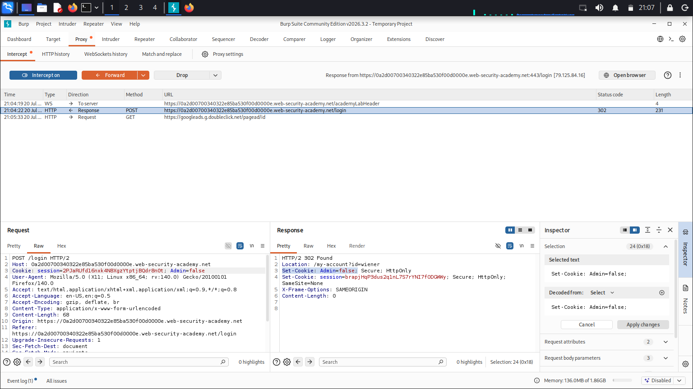
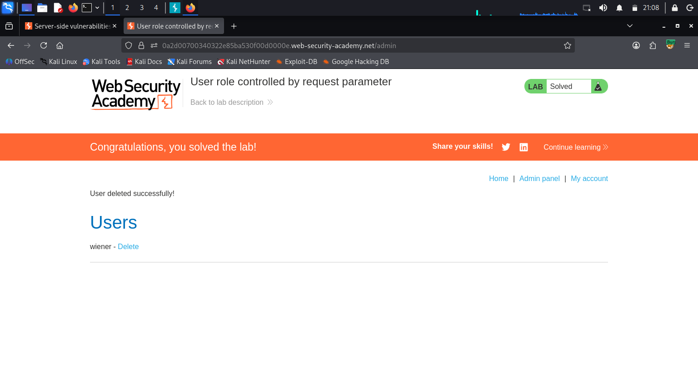

# Lab: User role controlled by request parameter (PortSwigger) - Write-up

## 1. Summary
The application in this laboratory contains a privilege escalation vulnerability where administrative privileges are determined by a forgeable client-side cookie (`Admin=false`). Because the application trusts the user-supplied cookie value without server-side verification, an attacker can modify the parameter to escalate their privileges to an administrator and access restricted functionalities.

- **Vulnerability Type:** Insecure Direct Object References (IDOR) / Broken Access Control (CWE-284)
- **Target Action:** Deleting the user `carlos`
- **Severity:** High (Privilege Escalation to Administrator)

---

## 2. Reconnaissance & Initial Analysis
An initial attempt to access the administrative panel directly via the `/admin` path resulted in a rejection, indicating that the application enforces some form of access control based on user identity or session state. 

To understand how the application determines roles, a legitimate login sequence was performed using the provided credentials (`wiener:peter`). During the authentication process, HTTP requests and responses were intercepted to inspect the session management mechanism and identify any parameters controlling user roles.

**Screenshot 1: Intercepting the Login Response (Burp Suite)**

---

## 3. Exploitation
By inspecting the intercepted HTTP response during login, it was discovered that the application sets a cookie named `Admin` with a boolean value of `false` (`Set-Cookie: Admin=false`). Since this parameter is handled on the client side, it can be manipulated before the browser processes the response or in subsequent requests.

The steps to complete the exploitation are as follows:

1. **Access and Attempt:** Browse to `/admin` and observe that access is denied under normal user privileges.
2. **Intercept Authentication:** Navigate to the login page, enable interception (including response interception) in Burp Proxy, and log in using the credentials `wiener:peter`.
3. **Modify the Parameter:** Locate the `Set-Cookie: Admin=false` header in the intercepted server response and modify it to `Admin=true` before forwarding the response to the browser.
4. **Access Admin Panel:** With the modified cookie stored in the browser, navigate to the `/admin` path to successfully load the administrative interface.
5. **Execute Action:** Locate the user `carlos` on the dashboard and click the delete button to complete the objective.

**Screenshot 2: Admin Panel and Successful Deletion of Carlos**

Upon changing the cookie value to `true`, the application recognized the session as administrative, granting full access to the user management functions and allowing the successful deletion of the target account.

---

## 4. Remediation
To prevent client-side parameter tampering and unauthorized privilege escalation, the following measures should be implemented:
1. **Server-Side Role Validation:** Never trust access control states or roles sent directly from the client (such as cookies or hidden form fields). User roles must be determined and verified strictly on the server side based on the authenticated session ID.
2. **Cryptographic Protection:** If state information must be stored on the client side, ensure it is cryptographically signed and encrypted (e.g., using secure JSON Web Tokens - JWT) to prevent tampering or forgery.
3. **Principle of Least Privilege:** Ensure that the application explicitly checks the server-side session permissions before rendering administrative interfaces or executing sensitive state-changing actions like user deletion.
