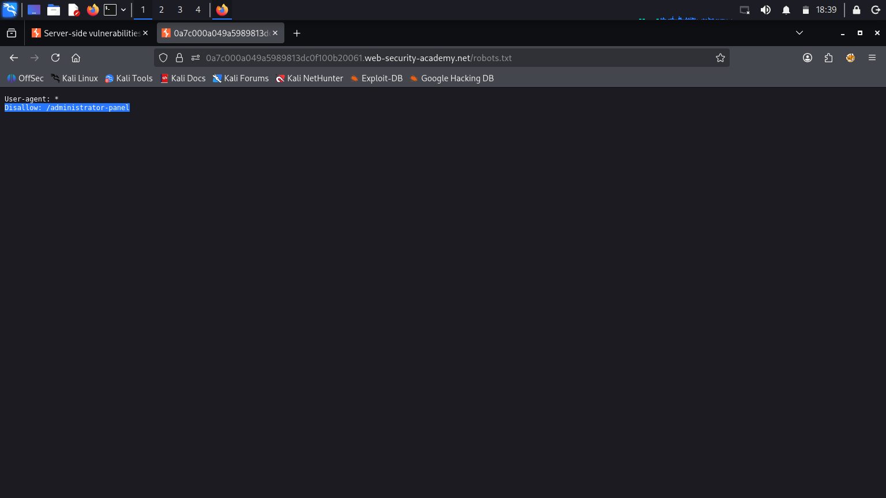
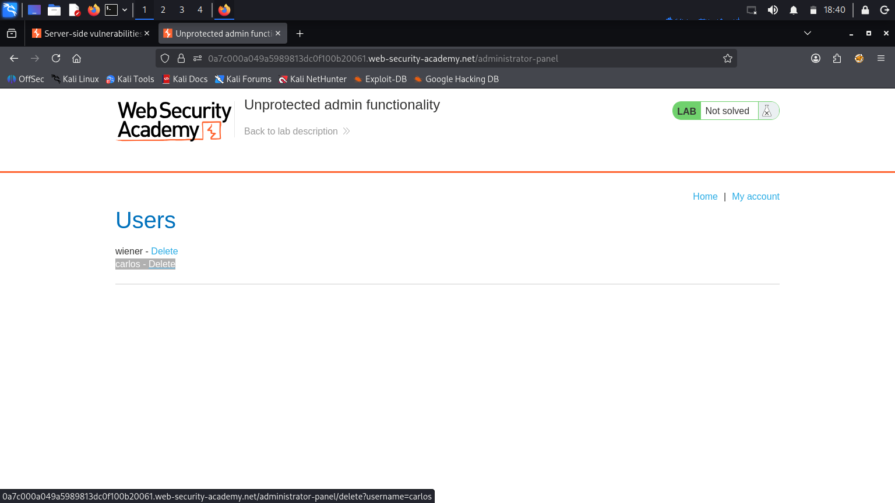

# Lab: Unprotected admin functionality (PortSwigger) - Write-up

## 1. Summary
The application in this laboratory contains an **Unprotected Admin Functionality** vulnerability because its administrative panel is not properly secured with access controls (such as authentication or authorization). By discovering the path to the administrative interface, any unauthenticated user can access sensitive administrative functions, including deleting user accounts.

- **Vulnerability Type:** Missing Function-Level Access Control (CWE-285) / Sensitive Directory Exposure
- **Target Action:** Deleting the user `carlos`
- **Severity:** High (Unauthorized Administrative Access)

---

## 2. Reconnaissance
It was observed that the application exposes administrative pathways or configuration details in public-facing directories. Web crawlers and search engines are typically guided by a `robots.txt` file, which often inadvertently discloses sensitive paths that developers wish to hide from search indexing but fail to secure programmatically.

**Screenshot 1: Viewing robots.txt (Burp Suite or Browser Inspect Elements)**

---

## 3. Exploitation
To exploit the vulnerability, the hidden administrative path disclosed in the `robots.txt` file was accessed directly via the browser, granting administrative privileges without requiring credentials.

The steps to complete the exploitation are as follows:

1. 
    Go to the lab and view robots.txt by appending /robots.txt to the lab URL. Notice that the Disallow line discloses the path to the admin panel.
2. 
    In the URL bar, replace /robots.txt with /administrator-panel to load the admin panel.
3. 
    Delete carlos.

**Screenshot 2: Admin Panel and Successful Deletion of Carlos**

Upon navigating to the `/administrator-panel` path, the application rendered the administrative interface without prompting for authentication. Clicking the delete button next to the user `carlos` successfully triggered the deletion action, solving the lab.

---

## 4. Remediation
To prevent this type of vulnerability, the following measures should be implemented:
1. **Access Control:** Do not rely on "security through obscurity." All administrative interfaces must be protected by robust authentication and authorization mechanisms, regardless of how hidden the URL is.
2. **Review Disallowed Paths:** Avoid listing sensitive administrative directories in public files like `robots.txt`. Instead, secure those endpoints programmatically so that unauthorized requests are redirected to a login page or return a `404 Not Found` / `403 Forbidden` response.
