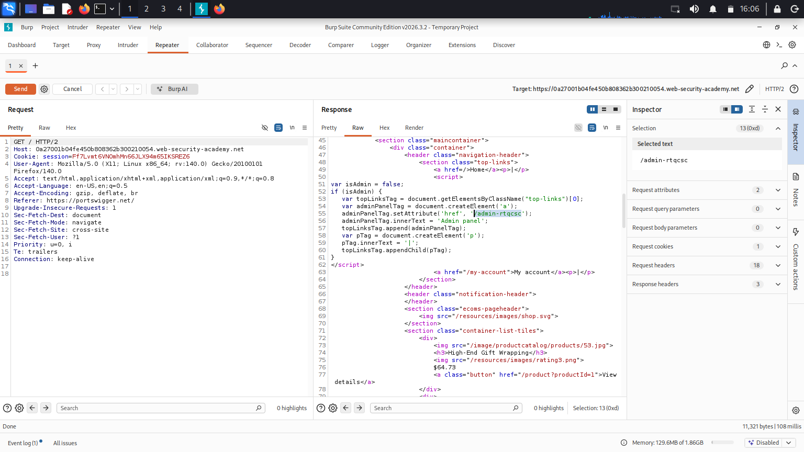
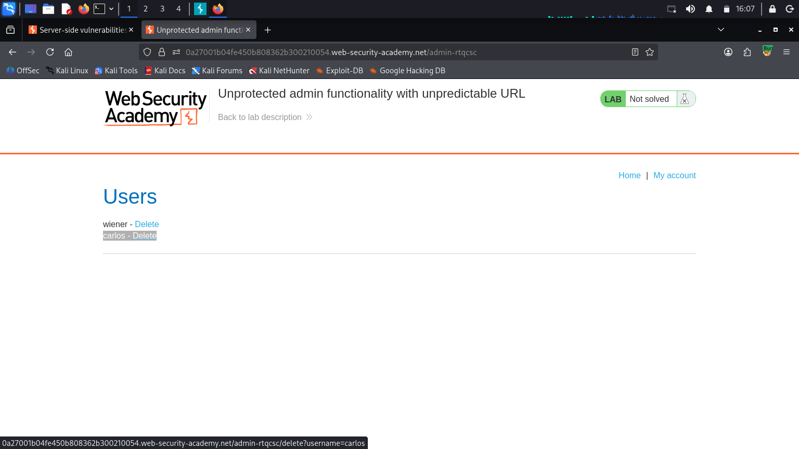

# Lab: Unprotected admin functionality with unpredictable URL (PortSwigger) - Write-up

## 1. Summary
The application in this laboratory contains an **Unprotected Admin Functionality with Unpredictable URL** vulnerability. While the administrative panel is located at an unpredictable, randomized URL to practice "security through obscurity," it is not properly secured with access controls (such as authentication or authorization). Furthermore, the application leaks this "hidden" URL within its front-end code, allowing any unauthenticated user to discover the path and perform administrative functions.

- **Vulnerability Type:** Missing Function-Level Access Control (CWE-285) / Security through Obscurity / Information Disclosure
- **Target Action:** Deleting the user `carlos`
- **Severity:** High (Unauthorized Administrative Access)

---

## 2. Reconnaissance
To find the unpredictable URL of the admin panel, the application's home page was analyzed. Since the URL is not guessable or listed in common directories like `robots.txt`, the client-side source code was inspected for any hardcoded paths or logic that might construct or disclose the administrative path.

By viewing the page source of the home page (via Burp Suite or browser developer tools), a JavaScript block was discovered. This script contains logic that exposes the unpredictable admin URL.

**Screenshot 1: Inspecting the Page Source for Hidden JavaScript**

*(The JavaScript code contains a variable or function disclosing the path, such as `'/admin-xxxxxx'`)*

---

## 3. Exploitation
To exploit the vulnerability, the leaked administrative path found in the JavaScript code was accessed directly, granting full administrative privileges without requiring any authentication.

The steps to complete the exploitation are as follows:

1. Load the lab's homepage and view the source code using Burp Suite or your browser's developer tools (F12).
2. Locate the JavaScript snippet disclosing the unpredictable admin URL (e.g., `'/admin-properties'` or a similar randomized string).
3. Append this unpredictable path to the lab's base URL in your browser to load the admin panel.
4. Locate the user `carlos` and click "Delete".

**Screenshot 2: Accessing the Admin Panel and Deleting Carlos**

Upon navigating to the discovered unpredictable URL, the administrative interface loaded without any authentication prompt. Clicking the delete button next to `carlos` successfully deleted the user and solved the lab.

---

## 4. Remediation
To prevent this type of vulnerability, the following measures should be implemented:

1. **Implement Proper Access Control:** Never rely on "security through obscurity" (such as using unpredictable URLs) to secure sensitive resources. All administrative panels must require robust authentication and role-based access control (RBAC).
2. **Prevent Information Disclosure:** Ensure that administrative paths, API endpoints, or sensitive logic are not exposed in client-side JavaScript, comments, or source code accessible to unauthorized users.
3. **Restrict Access by Default:** Configure the web server or application framework to return a `401 Unauthorized` or `403 Forbidden` status code for any unauthorized request attempting to access administrative endpoints, regardless of the URL complexity.
